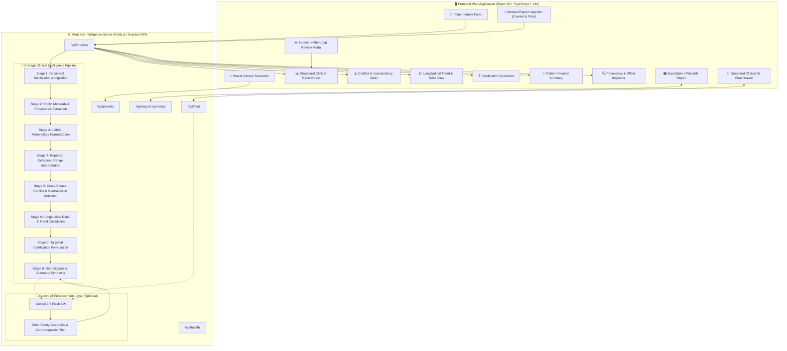
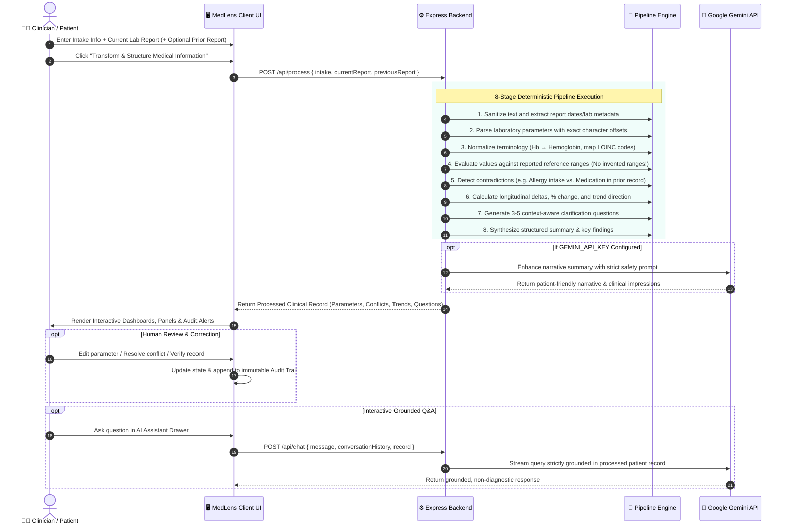
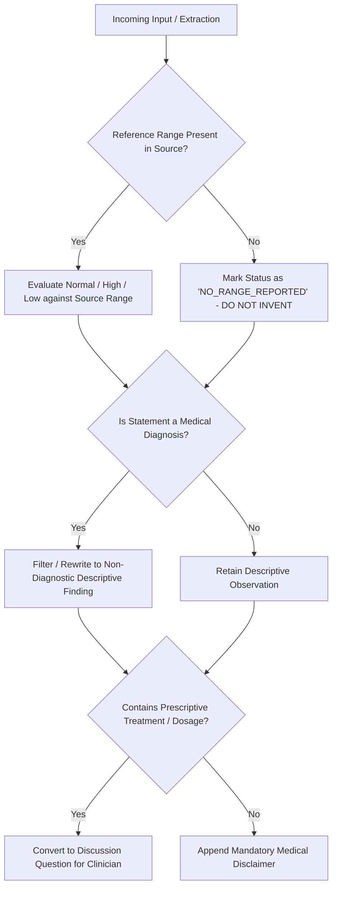
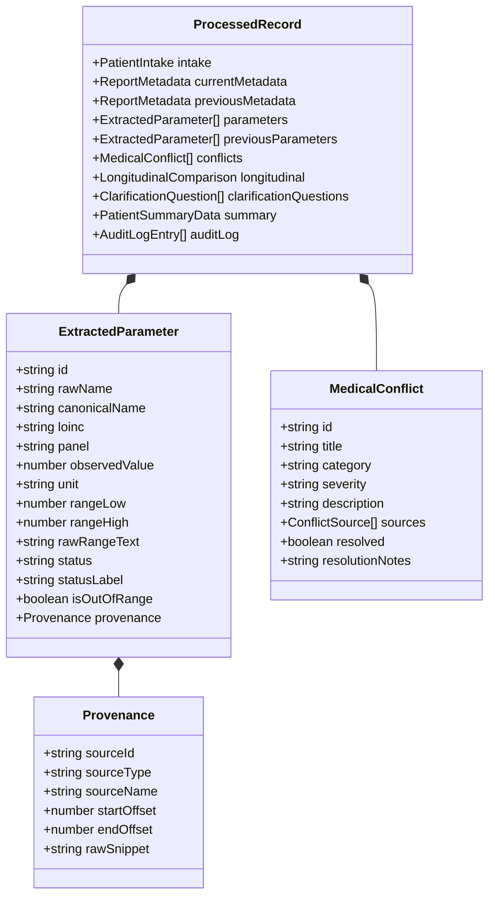

# 🏥 MedLens — AI-Powered Clinical Information Intelligence & Patient Intake System

[](https://opensource.org/licenses/MIT)
[](https://nodejs.org/)
[](https://reactjs.org/)
[](https://www.typescriptlang.org/)
[](https://vitejs.dev/)
[](https://ai.google.dev/)
[]()

> **MedLens** is an AI-assisted clinical information intelligence and patient intake system that transforms fragmented, unstructured medical documents, laboratory reports, and patient-provided histories into structured, traceable, and human-reviewable clinical records.
> 
> ⚠️ **CRITICAL SAFETY NOTICE**: MedLens is an **information intelligence and organization system — NOT a diagnostic or treatment system.** It does not diagnose diseases, prescribe therapies, adjust medication dosages, or replace qualified medical professionals.

---

## 📑 Table of Contents

- [The Challenge](#-the-challenge)
- [System Architecture](#-system-architecture)
- [End-to-End Pipeline Workflow](#-end-to-end-pipeline-workflow)
- [Core Requirement Tiers & Feature Matrix](#-core-requirement-tiers--feature-matrix)
- [Clinical Safety & Non-Diagnostic Guardrails](#-clinical-safety--non-diagnostic-guardrails)
- [Data Model & Provenance Traceability](#-data-model--provenance-traceability)
- [Interactive Clinical AI Chat Assistant](#-interactive-clinical-ai-chat-assistant)
- [API Reference & Data Contracts](#-api-reference--data-contracts)
- [Project Structure](#-project-structure)
- [Getting Started & Local Setup](#-getting-started--local-setup)
- [Automated Testing Suite](#-automated-testing-suite)
- [Deployment Guide](#-deployment-guide)

---

## 🎯 The Challenge

Medical data in modern healthcare settings is heavily fragmented across:
1. **Handwritten or digital patient intake forms** (patient-reported symptoms, allergies, medications).
2. **Laboratory assay sheets and pathology reports** (differing terminology, varying reference ranges).
3. **Historical medical records and prior hospital discharge summaries** (varying formats and dates).

Healthcare professionals often spend significant clinical time manually collecting, transcribing, standardizing, reconciling contradictions, and comparing historical deltas.

**MedLens solves this by delivering an automated, deterministic-first, AI-enhanced processing pipeline that operates strictly within non-diagnostic boundaries.**

---

## 🏛 System Architecture

MedLens utilizes a high-reliability **hybrid processing architecture**. A deterministic clinical rule engine performs lexical parsing, LOINC normalization, reference range comparison, conflict identification, and longitudinal math. An optional **Google Gemini 2.5 Flash** layer enriches patient narratives and powers grounded conversational Q&A.



---

## 🔄 End-to-End Pipeline Workflow

The complete processing lifecycle follows the required sequential progression:
$$\text{Input} \longrightarrow \text{Extraction} \longrightarrow \text{Validation} \longrightarrow \text{Normalization} \longrightarrow \text{Analysis} \longrightarrow \text{Insight} \longrightarrow \text{Human Review}$$



---

## 📊 Core Requirement Tiers & Feature Matrix

| Tier | Feature / Requirement | MedLens Implementation | Status |
|---|---|---|:---:|
| **Must Have** | **1. Patient Intake Form** | Captures Name, Age, Sex, Symptoms, Conditions, Allergies, Medications, and Notes. Distinctly badges data as `User-Provided Intake`. | ✅ **Complete** |
| **Must Have** | **2. Medical Report Processing** | Ingests raw text or files (.txt, .csv, .json, .log), extracts test name, observed value, unit, reference range, report date, and impressions. Maps abbreviations (e.g., `Hb` $\rightarrow$ `Hemoglobin` $\rightarrow$ `HGB`). Maintains character offsets. | ✅ **Complete** |
| **Must Have** | **3. Structured Medical Record** | Organized into categorized tabs & panels (Hematology, Metabolic, Lipid, Renal, Liver, Endocrine, Urine) with searchable, filterable data tables. | ✅ **Complete** |
| **Must Have** | **4. Reference Range Awareness** | Evaluates values as `Normal`, `Low`, `High`, `Critical Low`, `Critical High` **only** against ranges reported in the source. **Never invents missing ranges** (`NO_RANGE_REPORTED`). | ✅ **Complete** |
| **Must Have** | **5. Source Tagging & Provenance** | Every parameter, symptom, and observation carries a provenance tag: `User Intake`, `Current Report`, `Historical Baseline`, or `AI Synthesis`. | ✅ **Complete** |
| **Must Have** | **6. AI-Generated Summary** | Clear patient summary highlighting key findings, out-of-range assays, and observations with strict non-diagnostic phrasing. | ✅ **Complete** |
| **Should Have**| **7. Inconsistency & Conflict Detection** | Rule-based engine checks allergy contradictions, medication-condition conflicts, age/sex mismatches, and opposing clinical statements across sources. | ✅ **Complete** |
| **Should Have**| **8. Clarification Questions** | Dynamically formulates 3–5 targeted questions for patient/physician discussion regarding missing timelines, out-of-range labs, or conflicting records. | ✅ **Complete** |
| **Should Have**| **9. Human Review & Verification** | Complete modal interface to edit extracted fields, correct values, verify parameters, and resolve flagged conflicts with an immutable audit log. | ✅ **Complete** |
| **Nice to Have**| **10. Longitudinal Comparison** | Automatic comparison between baseline and current reports: calculates numerical deltas, percentage change, and trend direction ($\uparrow, \downarrow, \rightarrow$). | ✅ **Complete** |
| **Enhancement**| **PDF / Exportable Report** | One-click generation of a clean, printer-friendly summary report with patient profile, parameters, flagged conflicts, and medical disclaimer. | ✅ **Complete** |
| **Enhancement**| **Grounded AI Clinical Chat** | Interactive slide-out chat drawer powered by Gemini, grounded exclusively in the processed record with quick-prompt suggestions. | ✅ **Complete** |
| **Enhancement**| **Preset Clinical Scenarios** | 4 pre-built clinical cases: Diabetic Nephropathy, Anemia & Fatigue, Polypharmacy Allergy Contradiction, and Acute Renal Discrepancy. | ✅ **Complete** |

---

## 🛡 Clinical Safety & Non-Diagnostic Guardrails

MedLens is engineered with strict clinical safety constraints to ensure AI assistance never replaces medical judgment:



### Safety Principles Enforced in Code:
1. **Zero Hallucinated Reference Ranges**: If a laboratory sheet does not print a reference range, the system tags the item as `No Range Reported in Source` rather than applying external default ranges that may not match local assay calibration.
2. **Non-Diagnostic Summaries**: Language is restricted to observational statements (e.g., *"Hemoglobin is below the laboratory's reported reference interval"* rather than *"Patient has microcytic anemia"*).
3. **No Treatment Prescriptions or Dosage Adjustments**: Any therapeutic suggestions are re-framed as clarification questions for patient-physician consultations.
4. **Mandatory Medical Disclaimer**: Prominently attached to every output view, exported summary, and chat response:
   > *"MedLens is an AI-assisted information organization system, not a medical device or diagnostic tool. Consult a qualified healthcare professional for medical diagnosis and treatment."*
5. **Credential Security**: All Gemini API keys are held exclusively on the backend server (`.env`) or securely injected per session in memory — never exposed to client bundles or browser logs.

---

## 🔍 Data Model & Provenance Traceability

Every extracted entity maintains a bidirectional audit trail linking the structured parameter back to the exact slice of raw source text.



---

## 💬 Interactive Clinical AI Chat Assistant

MedLens includes an interactive clinical chat drawer (`AIChatDrawer.tsx`) that allows users to ask ad-hoc questions about the structured patient record.

- **Strict Grounding**: The assistant's system instructions restrict answers exclusively to the provided patient intake, extracted laboratory parameters, and detected conflicts.
- **Pre-computed Question Chips**: Offers dynamic one-click prompts such as *"Explain out-of-range values in simple terms"*, *"Summarize topics for my doctor's appointment"*, or *"What questions should I ask about my medications?"*.
- **Direct Provenance Callouts**: References specific test names and reported reference intervals directly in conversational replies.

---

## 🔌 API Reference & Data Contracts

### 1. `POST /api/process`
Main entry point for running the 8-stage intelligence pipeline.

**Request Body:**
```json
{
  "intake": {
    "name": "Sarah Jenkins",
    "age": "56",
    "sex": "Female",
    "symptoms": "Progressive fatigue and increased thirst",
    "conditions": "Type 2 Diabetes Mellitus",
    "allergies": "No known drug allergies",
    "medications": "Metformin 1000 mg twice daily",
    "notes": "Follow-up visit"
  },
  "currentReport": "METROPOLITAN CLINICAL LABORATORY\nDate: 08/20/2026\nHemoglobin: 10.2 g/dL (Ref: 13.0 - 17.5)\nFasting Blood Sugar: 146 mg/dL (Ref: 70 - 99)\nSerum Creatinine: 1.15 mg/dL (Ref: 0.50 - 1.10)",
  "previousReport": "Date: 02/15/2026\nHemoglobin: 11.1 g/dL (Ref: 13.0 - 17.5)\nFasting Blood Sugar: 122 mg/dL (Ref: 70 - 99)"
}
```

**Response Summary:**
```json
{
  "success": true,
  "executionTimeMs": 42,
  "stages": [...],
  "record": {
    "intake": {...},
    "parameters": [...],
    "panelGroups": {...},
    "longitudinal": {...},
    "conflicts": [...],
    "clarificationQuestions": [...],
    "summary": {...},
    "disclaimer": "..."
  }
}
```

---

### 2. `POST /api/chat`
Conversational clinical assistant grounded in the processed record.

**Request Body:**
```json
{
  "message": "What lab results should I ask my doctor about?",
  "conversationHistory": [],
  "record": { ... }
}
```

---

### 3. `GET /api/presets`
Returns built-in clinical test scenarios (e.g. Diabetic Nephropathy, Anemia, Allergy Contradictions).

---

### 4. `POST /api/export-summary`
Generates formatted, printable HTML summary document for patient or physician handoff.

---

### 5. `GET /api/health`
Returns system status, version, and Gemini API key readiness.

---

## 📁 Project Structure

```
MedLens/
├── server/                                # Backend Express API & Clinical Pipeline
│   ├── index.js                           # Server entrypoint & route controllers
│   ├── pipeline/
│   │   ├── extractor.js                   # Entity, provenance & metadata parsing
│   │   ├── normalizer.js                  # LOINC terminology dictionary & aliases
│   │   ├── rangeAnalyzer.js               # Reference range evaluation & safety
│   │   ├── conflictDetector.js            # Cross-source contradiction matrix
│   │   ├── longitudinalComparator.js      # Delta, %, and trend calculations
│   │   ├── clarificationGenerator.js      # Context-aware question generation
│   │   ├── summaryGenerator.js            # Structured non-diagnostic summary
│   │   ├── geminiEnhancer.js              # Google Gemini 2.5 Flash integration
│   │   └── chatAssistant.js               # Grounded clinical chat handler
│   └── presets/
│       └── sampleCases.js                 # 4 rich clinical evaluation scenarios
├── src/                                   # Frontend React 18 + TypeScript SPA
│   ├── main.tsx                           # Application bootstrapping
│   ├── App.tsx                            # Primary application state orchestrator
│   ├── index.css                          # Modern clinical design system tokens
│   ├── types.ts                           # Comprehensive TypeScript domain types
│   └── components/
│       ├── Header.tsx                     # Header bar with preset case selector
│       ├── IntakeForm.tsx                 # Patient profile & intake inputs
│       ├── ReportInput.tsx                # Multi-report document upload & text tabs
│       ├── PipelineProgress.tsx           # Interactive 8-stage progress tracker
│       ├── StructuredRecordView.tsx       # Searchable, filterable lab parameters table
│       ├── ConflictAlerts.tsx             # Cross-source conflict cards & resolver
│       ├── LongitudinalComparison.tsx     # Historical baseline comparison & trends
│       ├── ClarificationQuestions.tsx     # Targeted clinical question cards
│       ├── PatientSummary.tsx             # Patient narrative & key findings
│       ├── TraceabilityViewer.tsx         # Raw source text offset provenance inspector
│       ├── HumanReviewModal.tsx           # Parameter editing & verification dialog
│       ├── AIChatDrawer.tsx               # Slide-out grounded AI assistant
│       ├── PrintableReport.tsx            # Clean print/export summary view
│       └── SettingsModal.tsx              # API key & environment settings
├── tests/                                 # Unit & Integration Test Suites
│   ├── extractor.test.js                  # Provenance & entity parsing tests
│   ├── normalizer.test.js                 # Terminology & LOINC mapping tests
│   ├── rangeAnalyzer.test.js              # Reference range & safety rule tests
│   ├── conflictDetector.test.js           # Contradiction detection tests
│   ├── longitudinal.test.js               # Trend & delta calculation tests
│   ├── safety.test.js                     # Non-diagnostic boundary tests
│   └── test_gemini.js                     # Gemini connectivity verification script
├── index.html                             # Web application HTML shell
├── package.json                           # Dependencies and scripts
├── tsconfig.json                          # TypeScript configuration
└── vite.config.ts                         # Vite build configuration
```

---

## 🚀 Getting Started & Local Setup

### Prerequisites
- **Node.js**: v18.0.0 or higher
- **npm**: v9.0.0 or higher
- *(Optional)* **Google Gemini API Key**: For AI summary enhancement and chat (MedLens runs fully offline in deterministic rule engine mode if no key is provided).

### 1. Clone the Repository
```bash
git clone https://github.com/Dilip-geek/MedLens.git
cd MedLens
```

### 2. Install Dependencies
```bash
npm install
```

### 3. Configure Environment Variables
Create a `.env` file in the root directory:
```env
PORT=3001
GEMINI_API_KEY=your_gemini_api_key_here
```

### 4. Run the Development Server
To launch both the Express backend API and the Vite frontend client concurrently:
```bash
npm run dev
```

The application will be available at:
- **Frontend UI**: `http://localhost:5173`
- **Backend API**: `http://localhost:3001`

---

## 🧪 Automated Testing Suite

MedLens includes automated unit tests covering all core clinical intelligence pipeline modules.

To execute the test suite:
```bash
node --test tests/conflictDetector.test.js tests/extractor.test.js tests/longitudinal.test.js tests/normalizer.test.js tests/rangeAnalyzer.test.js tests/safety.test.js
```

### Verified Test Cases:
- ✔ `ConflictDetector`: Identifies allergy contradictions (e.g., *No known allergies* vs *Penicillin rash*).
- ✔ `ConflictDetector`: Identifies demographic age and sex discrepancies across records.
- ✔ `Extractor`: Extracts clinical metadata, dates, and laboratory entities with exact provenance offsets.
- ✔ `Extractor`: Normalizes units and extracts reported reference intervals.
- ✔ `LongitudinalComparator`: Calculates exact numerical deltas, percentage shifts, and directional arrows.
- ✔ `Normalizer`: Maps clinical synonyms (e.g., `Hb` $\rightarrow$ `Hemoglobin` $\rightarrow$ `HGB`).
- ✔ `RangeAnalyzer`: Evaluates Normal, Low, and High statuses strictly against reported intervals.
- ✔ `RangeAnalyzer Safety`: **Refuses to invent reference ranges** when missing from the source document.
- ✔ `Safety Engine`: Enforces non-diagnostic summary boundaries and attaches mandatory disclaimers.

---

## 🌐 Deployment Guide

### Deploying to Google Cloud Run
1. Build the production bundle:
   ```bash
   npm run build
   ```
2. Build and push the container image:
   ```bash
   gcloud builds submit --tag gcr.io/PROJECT_ID/medlens
   ```
3. Deploy to Cloud Run:
   ```bash
   gcloud run deploy medlens \
     --image gcr.io/PROJECT_ID/medlens \
     --platform managed \
     --allow-unauthenticated \
     --set-env-vars GEMINI_API_KEY=your_gemini_api_key
   ```

### Deploying to Vercel / Render / Railway
The backend server (`server/index.js`) is pre-configured to statically serve the compiled `dist/` production frontend bundle whenever `dist/` is present.

---

## 📄 License

This project is licensed under the MIT License — see the [LICENSE](LICENSE) file for details.
